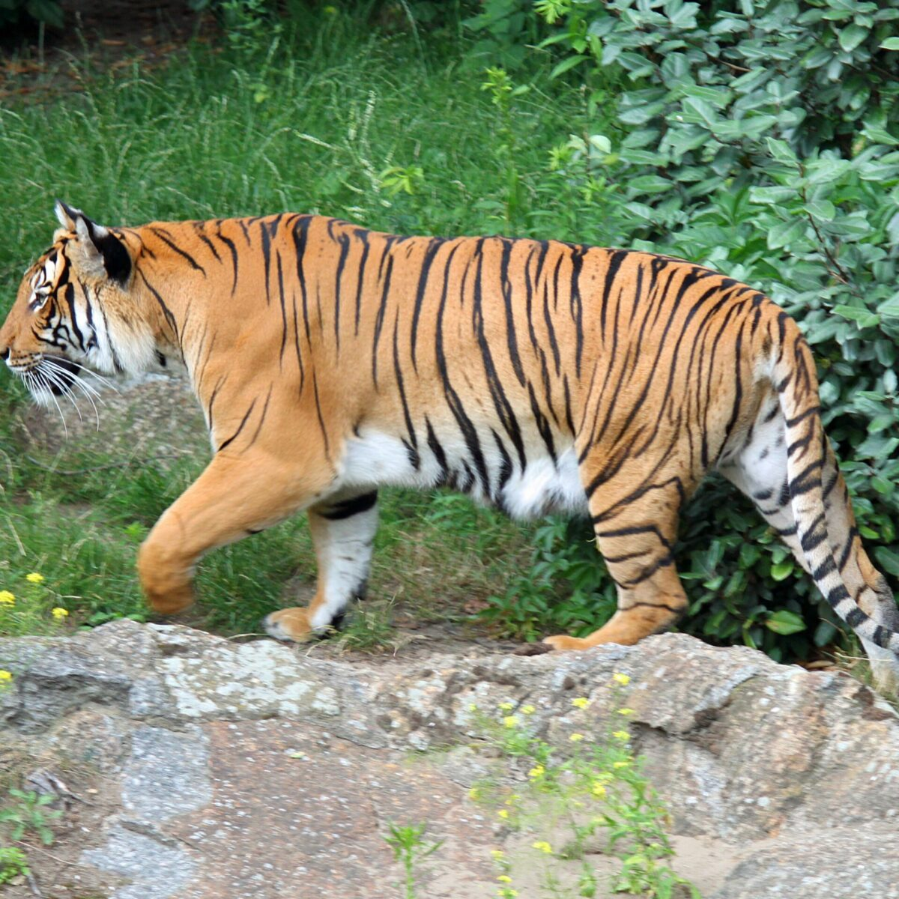
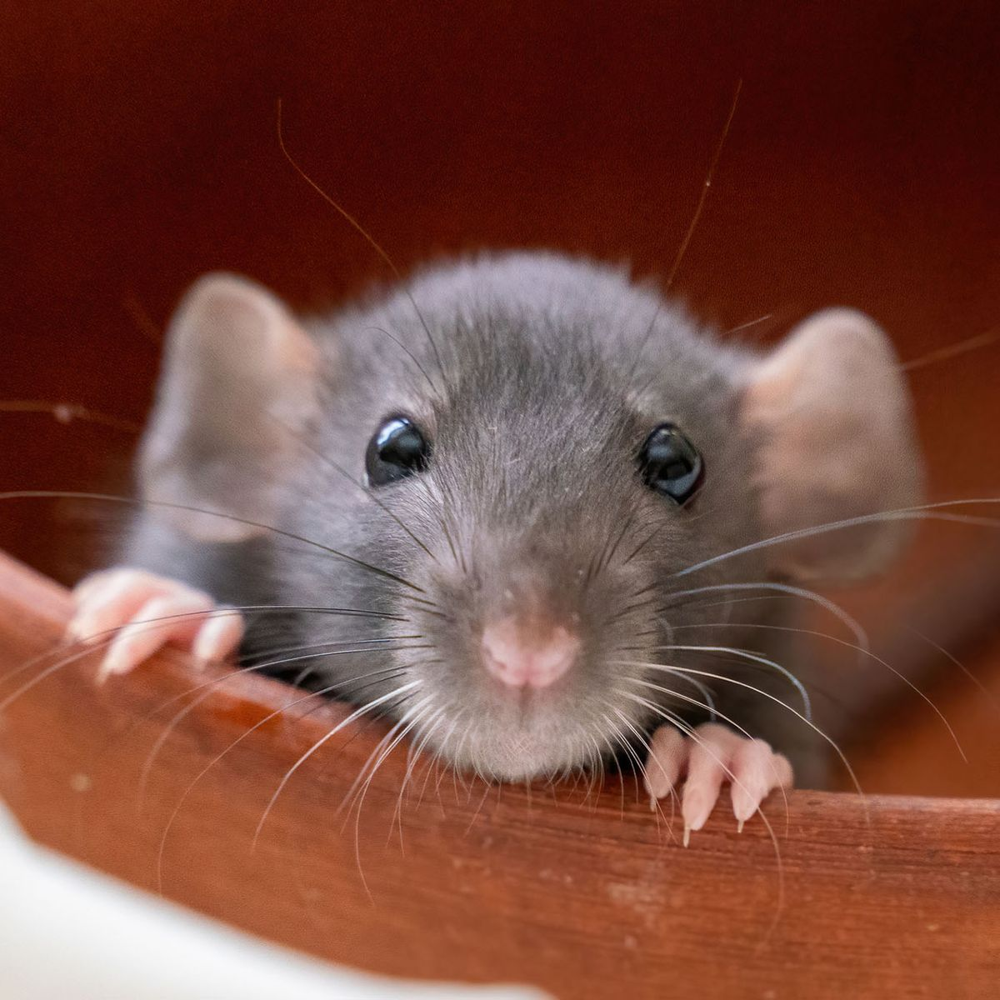
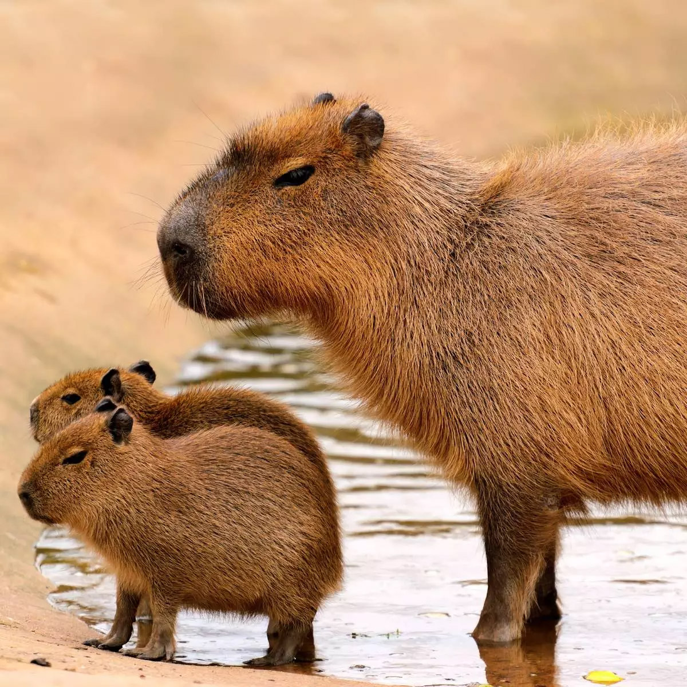
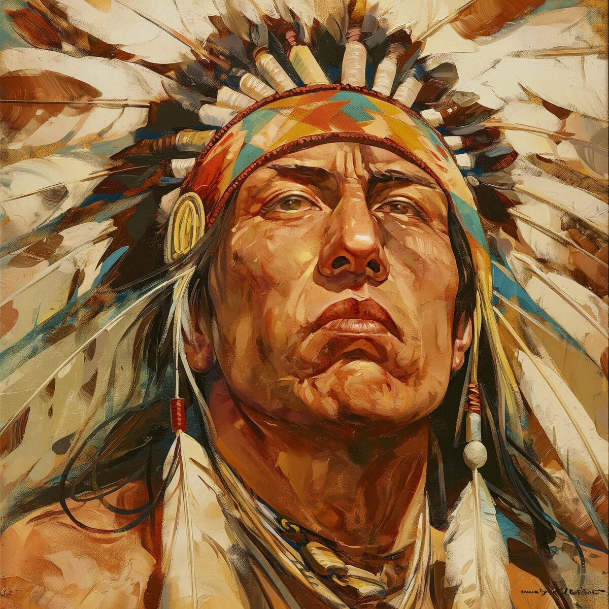

# Puzzle Craft

<div align="center">
  
  <h3>🧩 Akıl Geliştiren Yapboz Oyunu 🧠</h3>
</div>

---

## 📱 Uygulama Tanıtımı

Puzzle Craft, Flutter ile geliştirilmiş eğlenceli ve zihin geliştiren bir yapboz oyunudur. Görsel algı, dikkat ve problem çözme becerilerinizi geliştirirken keyifli zaman geçirmenizi sağlar. Farklı zorluk seviyelerinde oynayabilir, rekor kırmak için kendinizi zorlayabilirsiniz.

<div align="center">
  <table>
    <tr>
      <td></td>
      <td></td>
      <td></td>
    </tr>
  </table>
</div>

## ✨ Özellikler

- 📊 Üç farklı zorluk seviyesi (3x3, 4x4, 5x5)
- 🖼️ 15 farklı görsel içeriği ile zengin oyun deneyimi
- 🌈 Animasyonlu ve etkileşimli arayüz tasarımı
- 🔄 Akıllı görsel dönüşüm sistemi
- ⏱️ Süre ve hamle takip sistemi
- 🎯 Tamamlama başarısını kutlayan konfeti efektleri
- 📱 Çoklu platform desteği (Android, iOS, Web, Windows)
- 🌐 Çoklu dil desteği (Türkçe ve İngilizce)
- 📚 Kapsamlı oyun öğreticisi

## 📷 Ekran Görüntüleri

<div align="center">
  <table>
    <tr>
      <td align="center"><strong>Ana Menü</strong></td>
      <td align="center"><strong>Oyun Ekranı</strong></td>
      <td align="center"><strong>Öğretici</strong></td>
    </tr>
    <tr>
      <td><em>Ana ekran görseli</em></td>
      <td><em>Oyun ekranı görseli</em></td>
      <td><em>Öğretici ekran görseli</em></td>
    </tr>
  </table>
</div>

## 🚀 Başlarken

### Gereksinimler

- Flutter SDK (2.10.0 veya üstü)
- Dart SDK (2.16.0 veya üstü)
- Geliştirme Ortamı (Android Studio, VS Code vb.)

### Kurulum

1. Projeyi klonlayın:
```bash
git clone https://github.com/yourusername/puzzlegame.git
```

2. Projeye gidin:
```bash
cd puzzlegame
```

3. Bağımlılıkları yükleyin:
```bash
flutter pub get
```

4. Uygulamayı başlatın:
```bash
flutter run
```

## 🎮 Nasıl Oynanır?

1. **Zorluk Seviyesi Seçin**: Ana ekrandan kolay (3x3), orta (4x4) veya zor (5x5) zorluk seviyesini seçin.
2. **Başla**: "Oyna" butonuna tıklayarak oyunu başlatın.
3. **Parçaları Kaydırın**: Parçaları boş alana taşıyarak yapbozu tamamlamaya çalışın.
4. **Oyun Bitimi**: Tüm parçaları doğru sırada yerleştirdiğinizde oyun tamamlanır.

## 🧰 Teknik Detaylar

### Kullanılan Teknolojiler

- **Framework**: Flutter 3.x
- **Dil**: Dart 3.x
- **State Management**: Provider
- **Animasyon**: Flutter Animate
- **Yerelleştirme**: Flutter Localizations, intl
- **Efekt**: Confetti
- **Renk Analizi**: Palette Generator
- **Depolama**: Shared Preferences

### Proje Yapısı

```
lib/
├── main.dart           # Ana uygulama girişi
├── core/              # Çekirdek bileşenler
│   ├── constants/     # Sabit değerler
│   ├── providers/     # State yönetimi
│   ├── theme/         # Tema tanımları
│   └── widgets/       # Ortak bileşenler
├── domain/            # Domain modelleri
│   └── models/        # Veri modelleri
├── l10n/              # Yerelleştirme dosyaları
│   └── app_*.arb      # Dil çevirileri
└── puzzle/            # Ana uygulama modülü
    ├── logic/         # İş mantığı
    └── presentation/  # UI Ekranları
        ├── screens/   # Ana ekranlar
        ├── tutorial/  # Öğretici ekranı
        └── widgets/   # Özel bileşenler
```

## 🌐 Desteklenen Diller

- 🇹🇷 Türkçe
- 🇬🇧 İngilizce

## 🛠️ Geliştiriciler İçin

### Yeni Bir Dil Eklemek

1. `lib/l10n/` klasörü içinde yeni bir `app_[dil_kodu].arb` dosyası oluşturun
2. Mevcut çeviri anahtarlarını ve değerlerini yeni dile çevirin
3. `LanguageProvider` sınıfını güncelleyerek yeni dili ekleyin

### Yeni Görseller Eklemek

1. `assets/images/` klasörüne yeni görseller ekleyin
2. `pubspec.yaml` dosyasına bu görsellerin referanslarını ekleyin
3. `PuzzleScreen` sınıfındaki `imagePaths` listesine yeni görsel dosya yollarını ekleyin

## 📊 Gelecek Özellikler

- 🏆 Skor tablosu ve en iyi süre takibi
- 🌙 Gece modu geliştirmeleri
- 🎨 Özelleştirilebilir tema seçenekleri
- 🧩 Özel görsel yükleme özelliği
- 🔊 Ses efektleri ve müzikler
- 📊 İstatistik ve ilerleme takibi

## 📄 Lisans

Bu proje MIT lisansı altında lisanslanmıştır. Detaylı bilgi için [LICENSE](LICENSE) dosyasına bakabilirsiniz.

## 👨‍💻 Katkı Sağlama

Projeye katkıda bulunmak istiyorsanız, lütfen bir pull request açın veya öneri ve sorunlarınız için bir issue oluşturun.

---

<div align="center">
  <p>
    🌟 Eğer bu projeyi beğendiyseniz, lütfen yıldız vererek destek olun!
  </p>
  <p>
    © 2025 Puzzle Craft | Tüm hakları saklıdır
  </p>
</div>
